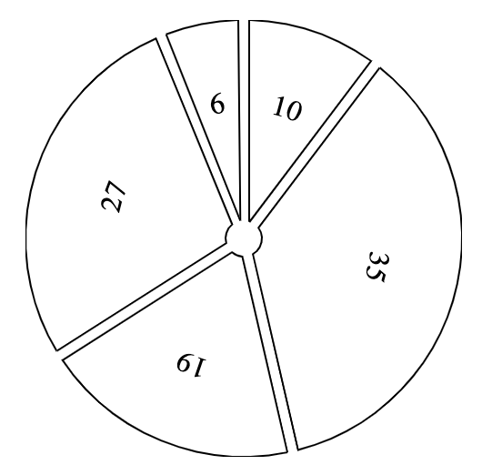
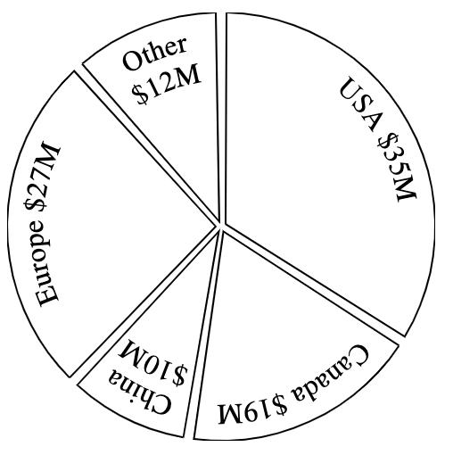
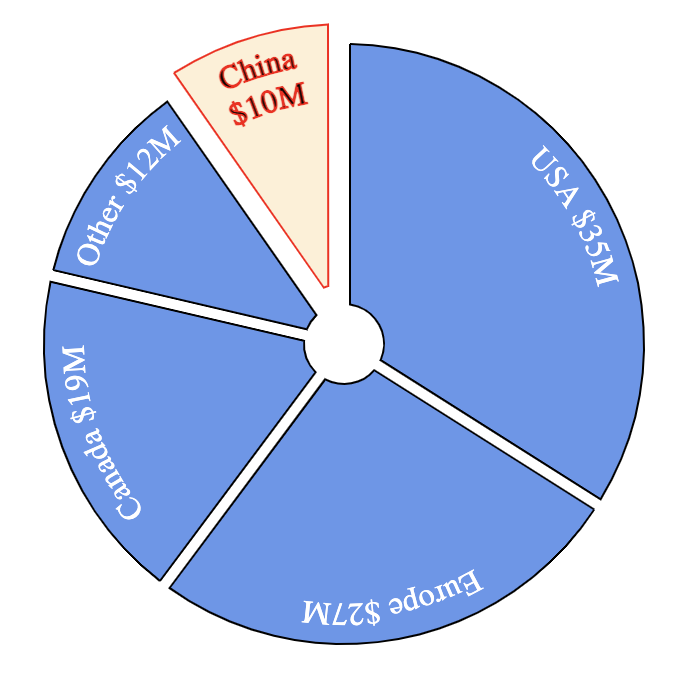
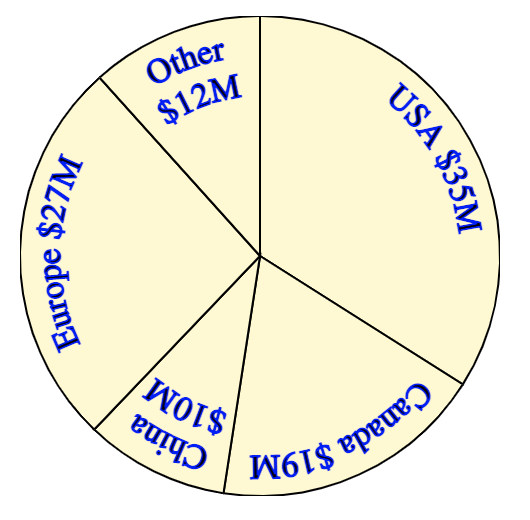
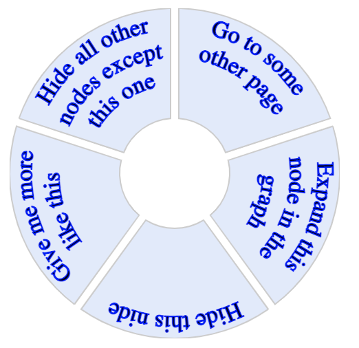
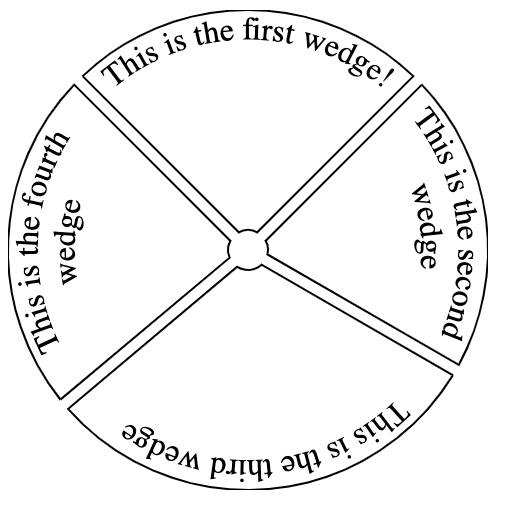
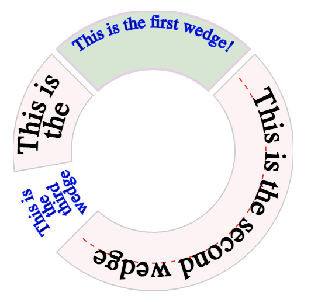

# Examples

This page shows some examples of what you can do, but the components
are designed to be extremely flexible and many other looks are possible.

# `Pie` component examples

## Simple


```javascript
import React from 'react';
import { Pie } from 'react-svg-pie';

export const Simple = () => {
  const data = [{ value: 10 }, { value: 35 }, { value: 19 }, { value: 27 }, { value: 6 }];
  return <Pie data={data} lineHeight={50} />;
};

```

## With captions



```javascript
import React from 'react';
import { Pie } from 'react-svg-pie';

export const WithCaptions = () => {
  const data = [
    { value: 35, caption: 'USA $35M' },
    { value: 19, caption: 'Canada $19M' },
    { value: 10, caption: 'China $10M' },
    { value: 27, caption: 'Europe $27M' },
    { value: 12, caption: 'Other $12M' },
  ];
  return <Pie data={data} lineHeight={20} centerRadius={3} />;
};
```

## Custom Styling



```javascript
import React from 'react';
import { Pie } from 'react-svg-pie';
import { makeStyles } from '@material-ui/core/styles';

const highlightStyles = makeStyles((theme) => ({
  text: {
    stroke: 'Red',
    },
  wedge: {
    fill: 'PapayaWhip',
    stroke: 'Red',
  },
}));

const regularStyles = makeStyles((theme) => ({
  text: {
    stroke: 'none',
    fill: 'White',
  },
  wedge: {
    fill: 'CornflowerBlue',
  },
}));

export const CustomStyling = () => {
  const highlightClasses = highlightStyles();
  const regularClasses = regularStyles();

  const data = [
    { value: 35, caption: 'USA $35M', classes: regularClasses },
    { value: 27, caption: 'Europe $27M', classes: regularClasses },
    { value: 19, caption: 'Canada $19M', classes: regularClasses },
    { value: 12, caption: 'Other $12M', classes: regularClasses },
    { value: 10, caption: 'China $10M', explode: 10, classes: highlightClasses },
  ];
  return <Pie data={data} radius={150} width={330} height={330} centerRadius={20} lineHeight={20} transform={'translate(15 15)'} />;
};
```
## Pie chart



```javascript
import React from 'react';
import { Pie } from 'react-svg-pie';
import { makeStyles } from '@material-ui/core/styles';

const useStyles = makeStyles((theme) => ({
  root: {
    stroke: 'Blue',
  },
  text: {
    fontSize: '17px',
  },
  wedge: {
    fill: 'LemonChiffon',
  },
}));

export const PieChart = () => {
  const classes = useStyles();
  const data = [
    { value: 35, caption: 'USA $35M', classes },
    { value: 19, caption: 'Canada $19M', classes },
    { value: 10, caption: 'China $10M', classes },
    { value: 27, caption: 'Europe $27M', classes },
    { value: 12, caption: 'Other $12M', classes },
  ];
  return <Pie data={data} lineHeight={20} centerRadius={0} margin={0} />;
};
```

## Pie menu



```javascript
import React from 'react';
import { Pie } from 'react-svg-pie';
import { makeStyles } from '@material-ui/core/styles';

const useStyles = makeStyles((theme) => ({
  root: {
    stroke: 'Blue',
  },
  text: {
    fontSize: '17px',
  },
  wedge: {
    fill: 'CornflowerBlue',
    opacity: 0.2,
    '&:hover': {
      opacity: 0.5,
    },
  },
}));

export const PieMenu = () => {
  const classes = useStyles();
  
  const data = [
    {
      value: 1,
      caption: 'Go to some other page',
      classes,
      onClick: () => {
        alert('Go to other page clicked');
      },
    },
    {
      value: 1,
      caption: 'Expand this node in the graph',
      classes,
      onClick: () => {
        alert('Expand clicked');
      },
    },
    {
      value: 1,
      caption: 'Hide this nide',
      classes,
      onClick: () => {
        alert('Hide clicked');
      },
    },
    {
      value: 1,
      caption: 'Give me more like this',
      classes,
      onClick: () => {
        alert('More clicked');
      },
    },
    {
      value: 1,
      caption: 'Hide all other nodes except this one',
      classes,
      onClick: () => {
        alert('Hide others clicked');
      },
    },
  ];

  return <Pie data={data} centerRadius={40} />;
};
```

# `TextWedge` component examples

## Default



```javascript
import React from 'react';
import { TextWedge } from 'react-svg-pie';

export const DefaultTextWedge = () => {
  return (
    <svg width="240" height="240">
      <TextWedge startAngle={315} endAngle={45} drawWedge>
        This is the first wedge!
      </TextWedge>
      <TextWedge startAngle={45} endAngle={120} drawWedge>
        This is the second wedge
      </TextWedge>
      <TextWedge startAngle={120} endAngle={230} drawWedge>
        This is the third wedge
      </TextWedge>
      <TextWedge startAngle={230} endAngle={315} drawWedge>
        This is the fourth wedge
      </TextWedge>
    </svg>
  );
};
```

## Custom



```javascript
import React from 'react';
import { TextWedge } from 'react-svg-pie';
import { makeStyles } from '@material-ui/core/styles';

export const CustomTextWedge = () => {
  const navClasses = navStyles();
  const actionClasses = actionStyles();
  return (
    <svg width="240" height="240">
      <TextWedge startAngle={315} endAngle={45} centerRadius={70} drawWedge classes={actionClasses}>
        This is the first wedge!
      </TextWedge>
      <TextWedge startAngle={45} endAngle={225} centerRadius={70} drawWedge drawBaseline classes={navClasses}>
        This is the second wedge
      </TextWedge>
      <TextWedge startAngle={225} endAngle={260} centerRadius={70} classes={actionClasses} lineSpacing={12}>
        This is the third wedge
      </TextWedge>
      <TextWedge startAngle={260} endAngle={315} centerRadius={70} drawWedge classes={navClasses} lineSpacing={19} lineHeight={21}>
        This is the fourth wedge
      </TextWedge>
    </svg>
  );
};
```