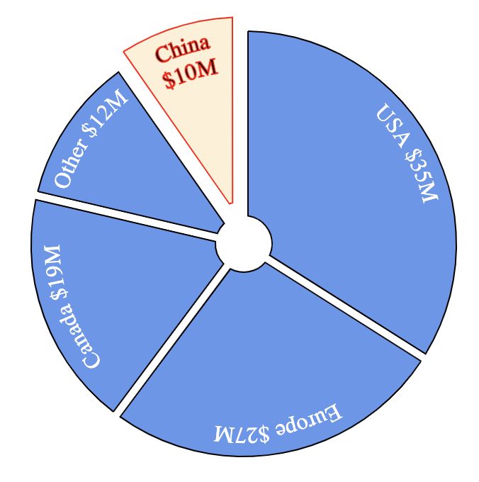

# react-svg-pie
A React.js component for drawing pie segments with wrapped text using SVG.

You can draw individual pie segments with the `TextWedge` component, or manage 
a collection of `TextWedge` instances using the `Pie` component.

The components use the Material UI mechanism for defining a default style and allowing 
applications to override any aspect of the CSS.

I built these components to be very flexible but have sensible defaults. This means that it's 
very easy to get started, and you can change anything that you need to later.

[This page contains some examples](EXAMPLES.md) of what the components look like, with
the code that was used to produce each example. There are also some 
[Storybooks](https://storybook.js.org/) that you can check out for 
[the Pie component](src/Pie/Pie.stories.js) and 
[the TextWedge component](src/TextWedge/TextWedge.stories.js).



# Getting started

To install this component, run this command in the root folder of your node.js application:
```bash
npm i react-svg-pie
```

To add a pie chart or pie menu to your application, add this to the top of your source file:
```javascript
import { Pie } from 'react-svg-pie';
```

To test if it's working, add this html to your component:
```javascript
   <Pie data={[{value:1, caption:'One'}, {value:1, caption:'Two'}, {value:1, caption:'Three'}]} />
```

Now take a look at the [examples](EXAMPLES.md) to get an idea about how this component can look.
If you want to do something very specific, the components and their `props` are documented below.
If you are still stuck, please raise an issue in GitHub. Thanks.

# The `Pie` component

This component provides a convenient method of creating a set of `TextWedge` components that
divide up a full circle in proportion to a set of data values. Each data value can also have
other information associated with it to customize the look of the corresponding text wedge.

## `Pie` component `props`

The props that have special meaning are documented below. In addition, any other props
that you set will be applied to the `<g>` element within the svg. This allows you to
add `onClick` handlers and set the `transform` for example.

### `radius`
The radius of the pie circle as a number of pixels. The width and height of the SVG drawing will
default to 2x this value. Defaults to 120 pixels.

### `width`
The width of the SVG image produced. If you do not specify a width then it will default
to 2x the radius of the pie.

### `height`
The height of the SVG image produced. If you do not specify a height then it will default
to 2x the radius of the pie.

### `centerRadius`
This is the radius of the 'hole' to leave in the center of the pie. This is useful
for creatng pie menus and doughnuts. Defaults to 10 pixels. Setting the `centerRadius`
to the same value as the `margin` will ensure that all wedges come to a point.

### `className`
The name of a CSS class to apply to the `<g>` element that wraps the pie drawing. In 
Material UI this is usually generated using the `makeStyles` function. This allows
you to style fonts, strokes and fills for the whole drawing.

### `margin`
The amount of space to leave around the sides of each pie segment. Defaults to 3 pixels.
Note that if each pie segment has 3 pixels of space on either side, then the distance
between two adjacent pie segments will be 6 pixels.

### `padding`
The amount of space to leave between the edge of the pie segment and the text inside of it. 
Defaults to 5 pixels.

### `lineSpacing`
This is the vertical distance between lines of text. If you do not set this prop, then the
text will be measured with all of the CSS styling applied to calculate the line spacing. Each
pie segment can use different text sizes and the margins and wrapping will work correctly for
each segment.

### `lineHeight`
The height of one line of text. By default this will be the 80% of the line spacing. This
prop only affects the distance between the outside edge of the pie and the top of the 
first line of text.

### `data`
The data to display on the pie. This defines the relative size of the pie
slices, the caption to display in each slice, and the styling to apply to each slice.

This is an example of the `data` prop:

```javascript
const data = [{
    value: 20,
    caption: 'China 20%',
    explode: 20
},{
    value: 30,
    caption: 'Europe 30%'
},{
    value: 10,
    caption: 'Canada 10%'
},{
    value: 40,
    caption: 'USA 40%'
}];

return <Pie data={data} />
```

Below are the properties that you can set for each pie segment in the `data` prop. 
Note that any other properties that you set will be passed to the `TextWedge` as
props. This allows you to set an `onClick` property for example and this
will be passed to `TextWedge` as an `onClick` prop.

#### `value`
The `value` property determines the relative size of the pie segments.
Each segment is sized in proportion to its value relative to the other
segments.

#### `caption`
This is the text to draw inside the segment. If no `caption` property is set
then the `value` will be drawn in the segment.

#### `classes`
Defines all of the CSS classes to use for this pie segment. This allows
you to style the wedge and the text within it any way you want for each
pie segment.

The classes object can be built using the Material UI `makeStyles` function.
This is illustrated in many of the [examples](EXAMPLES.md).

#### `explode`
The distance to explode this pie segment by. Exploded pie segments are
"pulled out" from the pie circle to draw attention to them. When you do this
you might need to move the whole pie drawing within SVG to avoid clipping the
exploded segments. You can do this by passing a `transform` prop to the `Pie`
component. There are [examples](EXAMPLES.md) of how to do this. 

## Custom styling

In the `data` prop you can specify a `classes` property for any wedge to 
override the styling of that wedge. The easy way to make this `classes` object 
is with the `makeStyles` function from the Material UI library.

Below is an example of a Pie with two different wedge styles:

```javascript
import { makeStyles } from '@material-ui/core/styles';

const navStyles = makeStyles((theme) => ({
  root: {
    stroke: 'red',
  },
  text: {
    fontSize: '25px',
    stroke: 'black',
  },
  wedge: {
    fill: 'pink',
    opacity: 0.2,
    '&:hover': {
      opacity: 0.4,
    },
  },
}));

const actionStyles = makeStyles((theme) => ({
  root: {
    stroke: 'blue',
  },
  text: {
    fontSize: '15px',
  },
  wedge: {
    fill: 'green',
    stroke: 'purple',
    strokeWidth: 2,
    opacity: 0.2,
    '&:hover': {
      opacity: 0.4,
    },
  },
}));

export const MyPie = () => {
  const navClasses = navStyles();
  const actionClasses = actionStyles();

  const data = [{
    value: 1,
    caption: 'Option 1',
    classes: navClasses
  },{
    value: 1,
    caption: 'Option 2',
    classes: navClasses
  },{
    value: 1,
    caption: 'Option 3',
    classes: actionClasses
  }{
    value: 1,
    caption: 'Option 4',
    classes: actionClasses
  },{
    value: 1,
    caption: 'Option 5',
    classes: actionClasses
  }];
  
  return (<Pie data={data} />
}

```

# The `TextWedge` component

The `Pie` component creates a set of `TextWedge` components internally, 
but you can create these yourself for ultimate flexibility like this:

```javascript
import React from 'react';
import { TextWedge } from 'react-svg-pie';
import { makeStyles } from '@material-ui/core/styles';

const useStyles = makeStyles((theme) => ({
  root: {
    stroke: 'blue',
  },
  text: {
    fontSize: '45px',
    fill: 'none',
  },
  wedge: {
    fill: 'green',
    stroke: 'black',
    strokeWidth: 2,
    fillOpacity: 0.2,
    '&:hover': {
      opacity: 0.4,
    },
  },
}));

export const CustomPie = () => {
  const classes = useStyles();
  return (
    <svg width="550" height="550">
      <TextWedge classes={classes} radius={250} centerRadius={50} startAngle={315} endAngle={45} drawWedge wedgeMargin={3}>
        This is the first wedge
      </TextWedge>
      <TextWedge classes={classes} radius={250} centerRadius={50} startAngle={45} endAngle={135} drawWedge wedgeMargin={3} explode={25}>
        This is the second wedge
      </TextWedge>
      <TextWedge classes={classes} radius={250} centerRadius={50} startAngle={135} endAngle={225} drawWedge wedgeMargin={3}>
        This is the third wedge
      </TextWedge>
      <TextWedge classes={classes} radius={250} centerRadius={50} startAngle={225} endAngle={315} drawWedge wedgeMargin={3}>
        This is the fourth wedge
      </TextWedge>
    </svg>
  );
};

```

Note that `TextWedge` outputs an SVG `<g>` element and must be put inside an `<svg>` 
element. It is done this way to give you more flexibility - for example you might want
to put multiple pie drawings in one SVG or combine the pie drawing with other drawing
elements.

## `TextWedge` component `props`
The `TextWedge` component has the following `props`, any other `props` passed to it will 
be passed down to the `<g>` element that it outputs. This allows you to pass other 
`props` such as `onClick` to the SVG group.

### `radius`
The distance from the center of the pie to the outside edge in pixels. Defaults to 120 pixels.
You can either pass the same value to all `TextWedge` components in the pie, or you can
leave the default 120 pixels and scale your SVG to whatever size you need.

### `centerRadius`
The radius of a circle in the middle of the pie that will not be drawn. This is useful
for cases where you want to draw a pie menu, or draw a doughnut. Defaults to 10 pixels.

### `startAngle`
The clockwise angle in degrees to start drawing at. This prop has no default and 
must be specified for every `TextWedge`. Zero degrees is North of the center
of the pie, 90 degrees is East, 180 degrees South and 270 degrees West. You can also
set negative values.

If the `startAngle` is less than the `endAngle` then the wedge is assumed to span
0 degrees. For example if you set the start to -45 degrees and the end to +45 degrees
then the text wedge will span 90 degrees with North in the center.

### `endAngle`
The angle in degrees to finish drawing at. This prop has no default and must be specified
for every `TextWedge`. The most common use case it to have the `endAngle` of one `TextWedge`
match the `startAngle` of the next `TextWedge` so that there are no gaps, but you can 
also overlap them or leave gaps if you like.

### `children`
You don't need to pass this `prop` explicitly, it will be set automatically by React and 
contains the nested elements. For this component the children must be text strings, you
cannot place other React components inside the `TextWedge` because it is an SVG drawing
and cannot contain arbitrary html elements.

### `className`
The name of a CSS class to apply to the root element of the `TextWedge`. In Material UI this
is usually generated using the `makeStyles` function.

### `classes`
Optionally pass an object that overrides the styling of all parts of the `TextWedge` component.
Using this prop, you can change the style of the root element, the text, the wedge drawing and 
baseline drawing.

### `lineSpacing`
This is the vertical distance between lines of text. If you do not set this `prop`, then the
text will be measured with all of the CSS styling applied to calculate the line spacing.

### `lineHeight`
The height of one line of text. By default this will be the 80% of the line spacing. This
prop only affects the distance between the outside edge of the pie and the top of the 
first line of text.

You can pass this `prop` move the text up and down within the `TextWedge`.

### `padding`
The number of pixels to leave between the left and right edge of the text and the edge of
the wedge border. The default is 5 pixels.

### `drawWedge`
Set this `prop` to a truthy value to draw the wedge. If you do not set this `prop` then
only the text will be drawn.

### `margin`
If `drawWedge` is `true`, then this `prop` sets the number of pixels to inset the border
of the wedge drawing. The default value is 3 pixels. If you are not drawing the wedge 
then this `prop` has no effect.

### `drawBaseline`
Set this `prop` to a truthy value to draw a line on the text baseline. This is mostly useful for 
debugging purposes, but can be used in production code if you like this effect. The style of the
baseline can be customized by passing a `classes` `prop` with a `baseline` property.

### `explode`
Defines how many pixels to displace this pie segment from the circle to make this 
pie segment stand out. By default pie segments are not exploded.
